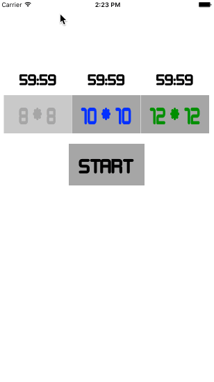

# P7-Minesweeper
CUAppDev Training Program Project #7 Fall 2015

### Can choose from 3 levels of difficulty ###

###Play game ###
* Timer keeps track of time passed
* Can flag certain mines
* Mines tell you number of mines on board (& if you flag any mines, it tells you the number of mines left to mark)
* Can quit game (& start a new game)
* 

