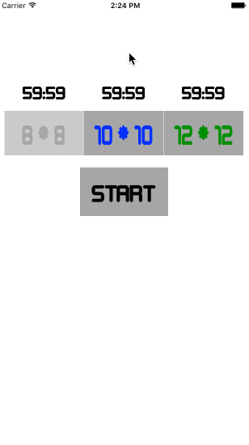

# Minesweeper
>###*CUAppDev Training Program Project #7 Fall 2015*

## Description
Taking it back to the classics, *Minesweeper* provides a mobile arena for this timeless puzzle game

## Features 

* 3 levels of difficulty
* Timer keeps track of time passed
* Can flag certain mines
* Mines tell you number of mines on board (& if you flag any mines, it tells you the number of mines left to mark)
* Can quit game (& start a new game)

 

